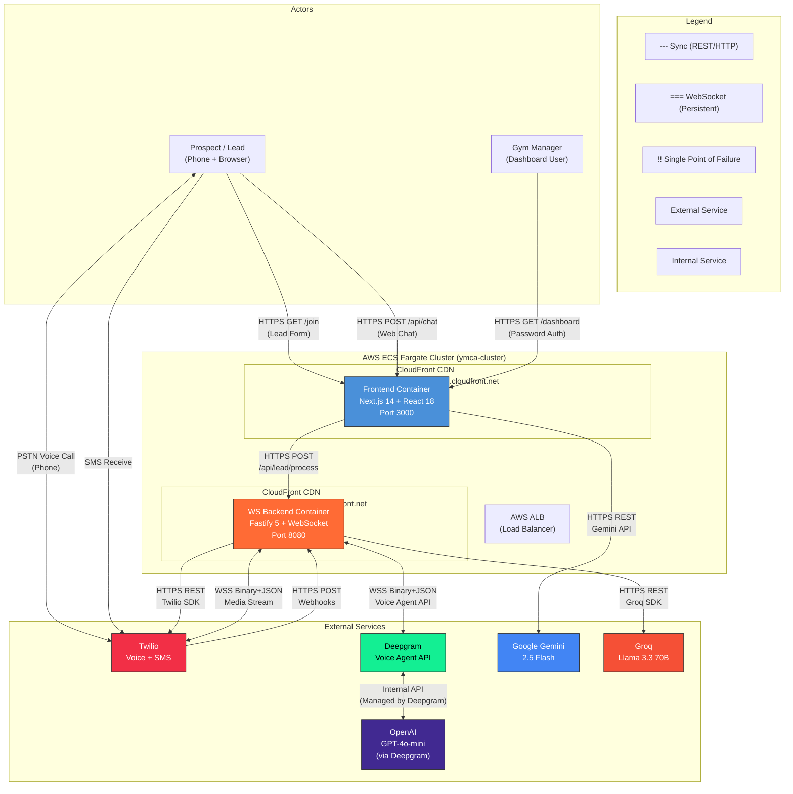
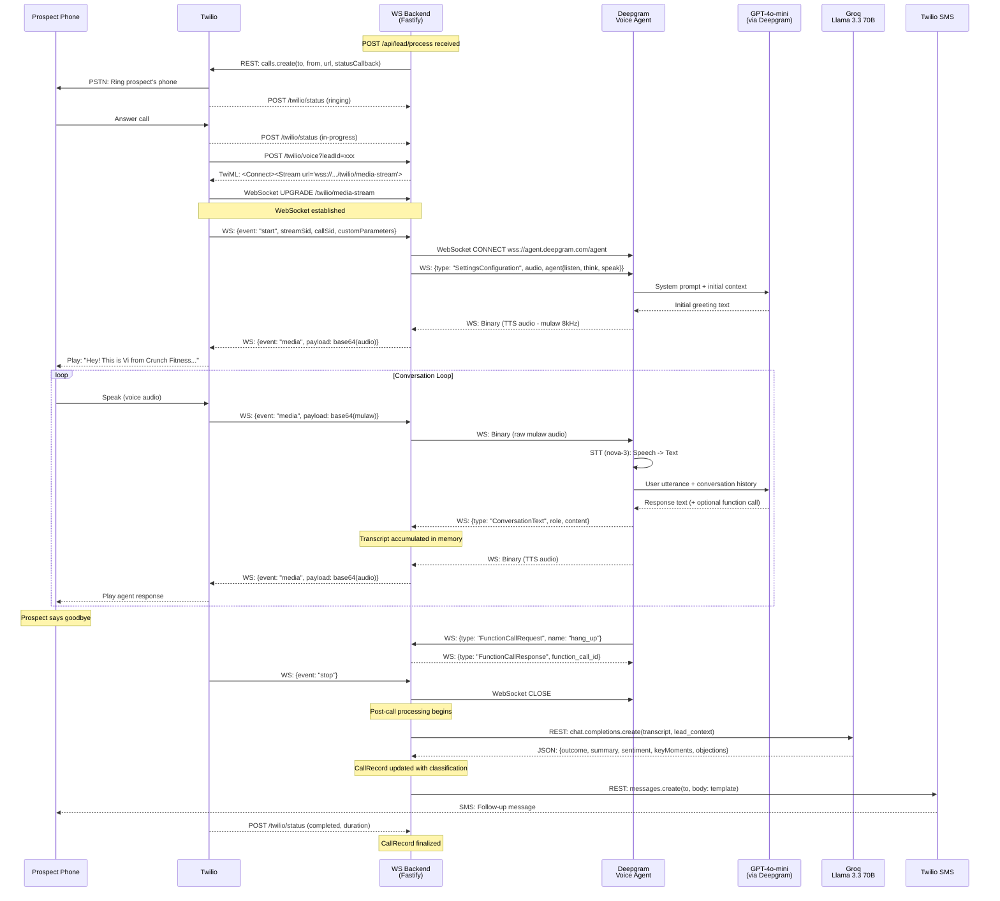
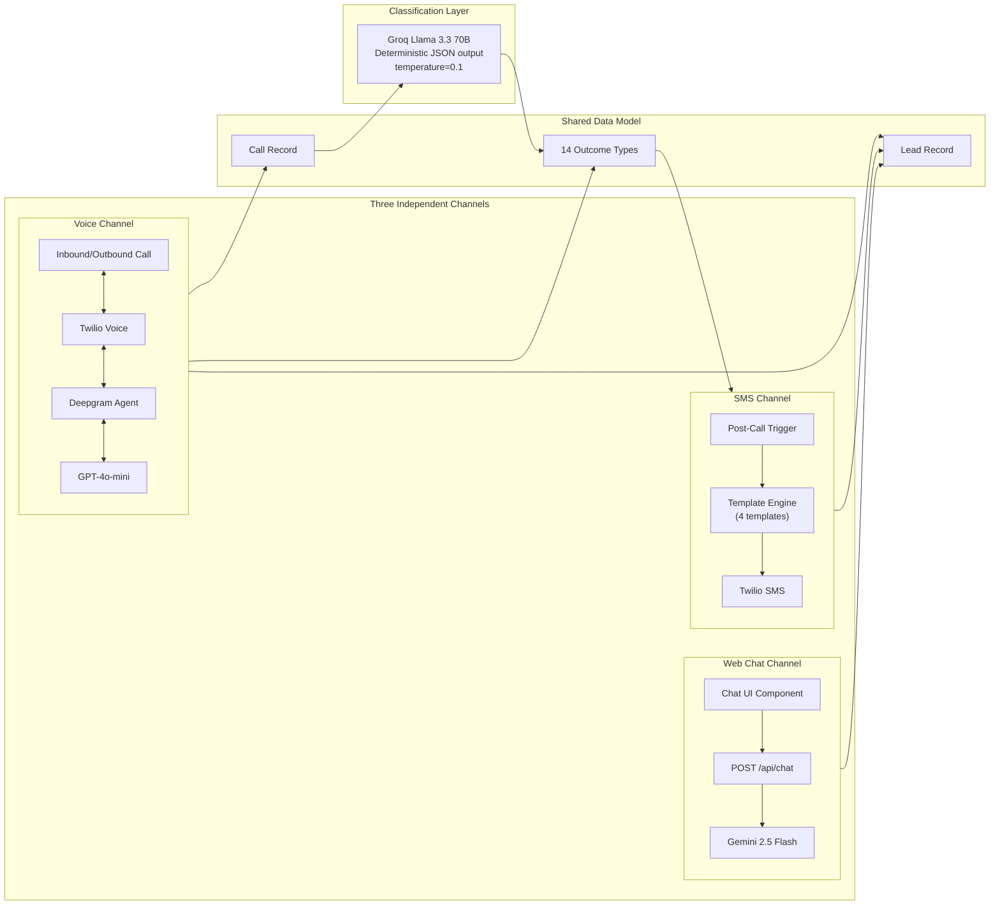
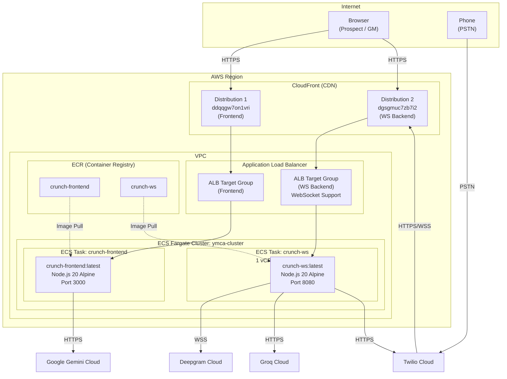

# Vi Operate for Crunch Fitness - Architecture Documentation

## 1. Mermaid Architecture Diagram (C4 Model)

### System Context Diagram

### Container Diagram (Detailed Internal Architecture)

```mermaid
graph TB
    subgraph frontend_container["Frontend Container (Next.js 14, Port 3000)"]
        subgraph pages["Pages (App Router)"]
            login_page["/ (Login Page)<br/>Password Gate"]
            join_page["/join<br/>Lead Form + Chat<br/>PUBLIC"]
            dashboard_page["/dashboard<br/>GM Analytics<br/>PASSWORD PROTECTED"]
        end

        subgraph api_routes["Next.js API Routes (Server-Side)"]
            api_lead["POST /api/lead/submit<br/>Validates + forwards lead"]
            api_chat["POST /api/chat<br/>Gemini proxy"]
            api_analytics["GET /api/analytics<br/>KPI aggregation"]
            api_calls["GET /api/calls<br/>Paginated call log"]
            api_call_detail["GET /api/calls/[id]<br/>Full call detail"]
            api_orchestrator["GET /api/orchestrator<br/>Multi-channel view"]
        end

        subgraph fe_components["React Components"]
            lead_form["LeadForm<br/>Form validation + submit"]
            web_chat["WebChat<br/>Gemini-powered chat UI"]
            kpi["KPICards"]
            call_log["CallLog<br/>Filterable table"]
            call_detail["CallDetail<br/>Transcript viewer"]
            outcome_dist["OutcomeDistribution"]
            funnel["ConversionFunnel"]
            location["LocationBreakdown"]
            orchestrator_view["OrchestratorView"]
        end

        subgraph fe_data["Data Layer"]
            seed_data_fe["seed-data.ts<br/>47 demo calls<br/>PRNG seed=42"]
            constants["constants.ts<br/>Pricing, locations"]
            utils["utils.ts<br/>Formatting helpers"]
            types_fe["types.ts<br/>Shared interfaces"]
        end

        join_page --> lead_form
        join_page --> web_chat
        dashboard_page --> kpi
        dashboard_page --> call_log
        dashboard_page --> call_detail
        dashboard_page --> outcome_dist
        dashboard_page --> funnel
        dashboard_page --> location
        dashboard_page --> orchestrator_view

        lead_form -->|"POST"| api_lead
        web_chat -->|"POST"| api_chat
        dashboard_page -->|"GET"| api_analytics
        dashboard_page -->|"GET"| api_calls
        call_log -->|"GET"| api_calls
        call_detail -->|"GET"| api_call_detail

        api_analytics --> seed_data_fe
        api_calls --> seed_data_fe
        api_call_detail --> seed_data_fe
    end

    subgraph backend_container["WS Backend Container (Fastify 5, Port 8080)"]
        subgraph routes["HTTP/WS Routes"]
            health["GET /health<br/>Health check"]
            lead_process["POST /api/lead/process<br/>Lead intake"]
            twilio_voice["POST /twilio/voice<br/>TwiML generator"]
            twilio_media["WS /twilio/media-stream<br/>Real-time audio bridge"]
            twilio_status["POST /twilio/status<br/>Call lifecycle callback"]
        end

        subgraph services["Services"]
            lead_proc["LeadProcessor<br/>Lead -> Call orchestration"]
            twilio_svc["TwilioService<br/>SDK wrapper (singleton)"]
            deepgram_agent["DeepgramAgent<br/>Voice AI WebSocket client"]
            call_mgr["CallManager<br/>Active session tracking<br/>(singleton)"]
            groq_class["GroqClassifier<br/>Post-call analysis"]
            sms_svc["SMSService<br/>Template-based follow-up"]
        end

        subgraph prompts["Prompt Engineering"]
            voice_prompt["voice-agent-system.ts<br/>Vi personality + rules"]
            class_prompt["classification-prompt.ts<br/>14-outcome classifier"]
            sms_templates["sms-templates.ts<br/>4 SMS templates"]
        end

        subgraph config["Configuration"]
            knowledge["crunch-knowledge.ts<br/>Locations, pricing,<br/>classes, amenities"]
            outcomes["outcomes.ts<br/>14 outcome definitions"]
        end

        subgraph be_data["In-Memory Data Stores"]
            leads_map["leads: Map&lt;string, Lead&gt;<br/>Active + seed leads"]
            calls_map["calls: Map&lt;string, CallRecord&gt;<br/>All call records"]
            sessions_map["sessions: Map&lt;string, ActiveCallSession&gt;<br/>Live calls only"]
        end

        lead_process --> lead_proc
        lead_proc --> twilio_svc
        twilio_voice --> leads_map
        twilio_media --> call_mgr
        twilio_media --> deepgram_agent
        twilio_media --> groq_class
        twilio_media --> sms_svc
        twilio_status --> calls_map
        sms_svc --> twilio_svc
        sms_svc --> sms_templates
        deepgram_agent --> voice_prompt
        groq_class --> class_prompt
        voice_prompt --> knowledge
        sms_svc --> outcomes
    end

    api_lead -->|"HTTPS POST<br/>/api/lead/process<br/>Fire-and-forget (5s timeout)"| lead_process
    api_chat -->|"HTTPS REST"| gemini_ext["Google Gemini API"]
    twilio_svc -->|"HTTPS REST<br/>Twilio SDK"| twilio_ext["Twilio REST API"]
    sms_svc -->|"HTTPS REST<br/>via TwilioService"| twilio_ext
    deepgram_agent <-->|"WSS<br/>mulaw 8kHz audio<br/>+ JSON control msgs"| deepgram_ext["Deepgram Voice Agent<br/>wss://agent.deepgram.com"]
    groq_class -->|"HTTPS REST<br/>Groq SDK<br/>JSON response_format"| groq_ext["Groq API<br/>llama-3.3-70b"]
    twilio_ext -->|"HTTPS POST<br/>Webhooks"| twilio_voice
    twilio_ext -->|"HTTPS POST<br/>Status Callback"| twilio_status
    twilio_ext <-->|"WSS<br/>Media Stream<br/>base64 mulaw"| twilio_media

    style leads_map fill:#e74c3c,stroke:#333,color:#fff
    style calls_map fill:#e74c3c,stroke:#333,color:#fff
    style sessions_map fill:#e67e22,stroke:#333,color:#fff
    style seed_data_fe fill:#e74c3c,stroke:#333,color:#fff
```

### Real-Time Voice Call Data Flow

### Multi-Channel Architecture

### Deployment Architecture

---

## 2. Component Inventory Table

| Name | Type | Language/Framework | Owner | Health/Status |
|------|------|-------------------|-------|---------------|
| **Frontend (crunch-frontend)** | Web Application | TypeScript / Next.js 14 + React 18 | Vi Team | Active - Demo |
| **WS Backend (crunch-ws)** | API + WebSocket Server | TypeScript / Fastify 5 | Vi Team | Active - Demo |
| **LeadForm** | React Component | TSX | Frontend | Active |
| **WebChat** | React Component | TSX | Frontend | Active |
| **Dashboard (7 sub-components)** | React Components | TSX | Frontend | Active |
| **OrchestratorView** | React Component | TSX | Frontend | Active |
| **seed-data.ts (FE)** | Data Generator | TypeScript | Frontend | Active (PRNG seed=42) |
| **seed-data.ts (BE)** | Data Generator | TypeScript | Backend | Active (47 hardcoded calls) |
| **LeadProcessor** | Service | TypeScript | Backend | Active |
| **TwilioService** | Service (Singleton) | TypeScript / Twilio SDK 5.5.1 | Backend | Active |
| **DeepgramAgent** | Service | TypeScript / ws 8.18.0 | Backend | Active |
| **CallManager** | Service (Singleton) | TypeScript | Backend | Active |
| **GroqClassifier** | Service | TypeScript / groq-sdk 0.9.1 | Backend | Active (graceful fallback) |
| **SMSService** | Service | TypeScript | Backend | Partial (missing 'welcome' template) |
| **Voice Agent Prompt** | Prompt Engineering | Text | Backend | Active |
| **Classification Prompt** | Prompt Engineering | Text | Backend | Active |
| **SMS Templates (4)** | Content Templates | Text | Backend | Active (3 of 4 referenced) |
| **Crunch Knowledge Base** | Static Config | TypeScript | Backend | Active |
| **Outcome Definitions (14)** | Static Config | TypeScript | Backend | Active |
| **Twilio** | External - Telephony + SMS | SaaS | Twilio Inc. | Production |
| **Deepgram Voice Agent** | External - Voice AI | SaaS | Deepgram Inc. | Production |
| **Rule-based Concierge** | Internal - Chat Engine | Local | -- | Production |
| **Groq (Llama 3.3 70B)** | External - Classification LLM | SaaS | Groq Inc. | Production |
| **OpenAI GPT-4o-mini** | External - Voice LLM (indirect) | SaaS | OpenAI | Production (via Deepgram) |
| **AWS CloudFront** | CDN | AWS | AWS | Production |
| **AWS ALB** | Load Balancer | AWS | AWS | Production |
| **AWS ECS Fargate** | Container Orchestration | AWS | AWS | Production |
| **AWS ECR** | Container Registry | AWS | AWS | Production |

---

## 3. Architectural Observations

### 3.1 Coupling Concerns

| Issue | Severity | Details |
|-------|----------|---------|
| **Frontend-Backend data model divergence** | Medium | Both `frontend/src/app/lib/seed-data.ts` and `ws-backend/src/seed-data.ts` independently generate demo data. The frontend generates its own 47 calls (PRNG seed=42) rather than querying the backend. Dashboard API routes (`/api/analytics`, `/api/calls`) read from frontend-local seed data, NOT from the WS backend. The systems are effectively decoupled at the data layer. |
| **Shared type duplication** | Medium | `types.ts` exists in both frontend (`lib/types.ts`) and backend (`types/index.ts`) with overlapping but not identical interfaces. No shared package or code generation ensures consistency. |
| **Prompt-config coupling** | Low | `voice-agent-system.ts` embeds pricing/location data inline AND imports from `crunch-knowledge.ts`. Changes must be synchronized in both places. |
| ~~SMS template gap~~ | ~~Low~~ | ~~Resolved: `sms-templates.ts` now includes the `welcome` template. All 4 templates referenced in `outcomes.ts` are defined.~~ |

### 3.2 Scalability Bottlenecks

| Bottleneck | Impact | Mitigation |
|------------|--------|------------|
| **In-memory data stores** | Critical | `Map<string, Lead>` and `Map<string, CallRecord>` in `server.ts` cannot scale horizontally. All data lost on restart. Single-instance only. Needs PostgreSQL/DynamoDB for production. |
| **Active call sessions in memory** | Critical | `CallManager` stores `ActiveCallSession` objects in a local `Map`. Cannot distribute across multiple ECS tasks. Limits to ~100-200 concurrent calls per instance (memory/CPU bound). |
| **WebSocket affinity** | High | Each active call requires a persistent WebSocket between Twilio, Fastify, and Deepgram. ALB must maintain sticky sessions. Cannot freely redistribute connections. |
| **Seed data on startup** | Low | 47 calls loaded synchronously on boot. Acceptable for demo; would need lazy loading or DB for production. |
| **Frontend seed data generation** | Low | Analytics computed on every API request from seed data. No caching. Acceptable at demo scale. |

### 3.3 Missing Resilience Patterns

| Pattern | Status | Recommendation |
|---------|--------|----------------|
| **Circuit breaker** | Missing | No circuit breaker on Deepgram, Groq, Gemini, or Twilio calls. A Deepgram outage would cause all calls to fail without graceful degradation. |
| **Retry with backoff** | Missing | `processLead()` makes a single Twilio call attempt. Lead status supports `callAttempts` counter but no automatic retry queue exists. |
| **Rate limiting** | Missing | `POST /api/lead/process` has no rate limiting. Could be abused to spam outbound calls. |
| **Health check depth** | Shallow | `GET /health` returns static `{status: 'ok'}`. Does not verify Twilio credentials, Deepgram connectivity, or Groq API availability. |
| **Graceful shutdown** | Missing | No `SIGTERM` handler to drain active WebSocket connections before container termination. Active calls would be abruptly dropped during ECS deployments. |
| **Dead letter queue** | Missing | Failed SMS sends are logged but not retried or queued. Failed classifications default to `tech-issue` with no re-processing. |
| **Timeout management** | Partial | Frontend has 5s timeout on lead submit. Backend has no explicit timeouts on Deepgram WebSocket or Groq API calls. Chat is local (no external timeout needed). |

### 3.4 Security Boundary Gaps

| Gap | Severity | Details |
|-----|----------|---------|
| **No Twilio webhook signature validation** | High | `POST /twilio/voice` and `POST /twilio/status` do not verify `X-Twilio-Signature`. Any HTTP client can forge webhook calls to initiate fake call flows or manipulate call records. |
| **No authentication on lead endpoint** | High | `POST /api/lead/process` accepts any request with valid JSON. No API key, CORS restriction (origin: `*`), or rate limiting. Could trigger unlimited outbound Twilio calls (billable). |
| ~~Client-side auth only~~ | ~~Medium~~ | ~~Resolved: Dashboard now uses server-side httpOnly cookie (`crunch_session`) set via `POST /api/auth/login`. All dashboard data routes (`/api/analytics`, `/api/calls`, `/api/calls/[id]`) validate the session cookie server-side and return 401 if absent.~~ |
| **API keys in environment** | Low | Standard practice, but no secrets manager integration (AWS Secrets Manager/SSM). Acceptable for demo. |
| **CORS wildcard** | Medium | `FRONTEND_URL` defaults to `*`, allowing any origin to call backend APIs. |
| **No input sanitization** | Medium | Lead submission phone/email validated on frontend but backend `POST /api/lead/process` does minimal validation. Potential for injection in SMS templates (lead name interpolated into SMS body). |
| ~~Gemini API key on frontend server~~ | ~~Low~~ | ~~No longer applicable: chat is now powered by a local rule-based concierge engine. No external API key needed for chat.~~ |

### 3.5 Drift from Stated Architecture Decisions (ADR Cross-Reference)

| ADR | Stated Decision | Actual Implementation | Drift? |
|-----|----------------|----------------------|--------|
| ADR 1: Deterministic/Probabilistic Separation | Business rules deterministic, conversation probabilistic | Pricing in system prompt (probabilistic) AND in `crunch-knowledge.ts` (deterministic). Classification via Groq with `temperature=0.1` (quasi-deterministic). | Minor drift - pricing could hallucinate in voice but is grounded by prompt |
| ADR 2: Multi-Model Strategy | GPT-4o-mini (voice), Gemini 2.5 Flash (chat), Llama 3.3 70B (classification) | Chat switched from Gemini to local rule-based concierge. Voice and classification unchanged. | **Drift** -- chat no longer uses Gemini |
| ADR 3: Two-Repository Architecture | Separate repos for frontend and backend | Both exist in single monorepo directory (`12. Vi_CF/frontend` and `12. Vi_CF/ws-backend`). Spec mentions separate GitHub repos. | Minor drift - development convenience, deploy scripts still reference separate ECR repos |
| ADR 4: In-Memory Storage | No database for v1 demo | Implemented as stated. Both frontend and backend use in-memory Maps + seed data. | No drift |
| ADR 5: CloudFront + ALB + ECS Fargate | AWS managed services | Implemented as stated with specific CloudFront distributions and ECS cluster | No drift |
| ADR 6: System Prompt-Based Conversation State | LLM-managed conversation flow, not hard-coded FSM | Implemented - prompt defines phases (Greeting, Qualification, Information, Booking, Close) as guidelines, not state machine | No drift |
| ADR 7: Post-Call Classification via Groq | Groq Llama 3.3 70B for structured classification | Implemented with JSON response format and `temperature=0.1` | No drift |
| **Spec: Dashboard uses WS Backend data** | Dashboard queries `GET /api/analytics` and `GET /api/calls` from WS backend | Frontend generates its own seed data locally; dashboard API routes never call WS backend | **Significant drift** - Dashboard is fully self-contained |

---

## 4. Recommended Follow-Up Diagrams

### 4.1 Critical Path Sequence Diagrams

| Diagram | Priority | Rationale |
|---------|----------|-----------|
| **Lead-to-Call Initiation** | P1 | Maps the exact request chain: Form submit -> Frontend API -> WS Backend -> Twilio -> Phone ring. Critical for debugging call failures. |
| **Deepgram Function Calling (hang_up, send_sms)** | P1 | Documents the function call/response protocol with Deepgram. Currently only two functions; will grow with features like tour booking. |
| **Error & Fallback Flows** | P1 | Maps what happens when Deepgram disconnects mid-call, Groq classification fails, or Twilio webhook is unreachable. Currently undocumented. |
| **Dashboard Data Pipeline** | P2 | Clarifies the current frontend-only seed data flow vs. the intended WS backend integration. Documents the drift identified in ADR cross-reference. |

### 4.2 Deployment Diagrams

| Diagram | Priority | Rationale |
|---------|----------|-----------|
| **CI/CD Pipeline** | P1 | Docker build -> ECR push -> ECS force-deploy flow. Currently manual (`aws ecs update-service`). No automated pipeline documented. |
| **Network Topology** | P2 | VPC, subnet, security group, ALB listener rules, CloudFront behaviors. Important for WebSocket routing (ALB must support persistent connections). |
| **Environment Configuration Matrix** | P2 | Map all 12+ env vars across dev/staging/production with their sources (`.env.local`, ECS task definition, Secrets Manager). |

### 4.3 Data Model Diagrams

| Diagram | Priority | Rationale |
|---------|----------|-----------|
| **Entity Relationship Diagram** | P1 | Lead -> CallRecord -> Classification -> SMS Follow-up relationships. Foundation for database migration (v2). |
| **State Machine: Lead Lifecycle** | P1 | `new -> calling -> connected -> completed -> classified -> followed-up` with error states. Currently implicit in code. |
| **State Machine: Call Lifecycle** | P2 | `initiated -> ringing -> connected -> completed` with Twilio status mapping. |

### 4.4 Future Architecture Diagrams

| Diagram | Priority | Rationale |
|---------|----------|-----------|
| **Horizontal Scaling Architecture** | P2 | Redis session store, PostgreSQL, distributed WebSocket with sticky sessions. Required for production. |
| **Multi-Tenant Architecture** | P3 | How to extend from Crunch Fitness to other gym brands (UFC, etc.) with tenant isolation. |
| **Cross-Channel Context Transfer** | P3 | How chat context could transfer to voice call and vice versa. Currently channels are independent. |

---

## 5. Environment Variable Reference

### Frontend (.env.local)

| Variable | Required | Default | Purpose |
|----------|----------|---------|---------|
| `NEXT_PUBLIC_WS_BACKEND_URL` | Yes | `http://localhost:8080` | WS Backend URL (client-accessible) |
| `WS_BACKEND_INTERNAL_URL` | No | `http://localhost:8080` | Internal backend URL (future: ECS service discovery) |
| ~~`GEMINI_API_KEY`~~ | ~~Yes~~ | ~~-~~ | ~~No longer needed: chat uses local rule-based concierge~~ |
| `DASHBOARD_PASSWORD` | No | `crunch2026` | Dashboard password (currently hardcoded in page.tsx) |

### WS Backend (.env)

| Variable | Required | Default | Purpose |
|----------|----------|---------|---------|
| `TWILIO_ACCOUNT_SID` | Yes | - | Twilio API authentication |
| `TWILIO_AUTH_TOKEN` | Yes | - | Twilio API authentication |
| `TWILIO_PHONE_NUMBER` | Yes | - | Outbound caller ID (E.164) |
| `TWILIO_WEBHOOK_URL` | Yes | - | Public URL for Twilio webhooks |
| `DEEPGRAM_API_KEY` | Yes | - | Deepgram Voice Agent authentication |
| `GROQ_API_KEY` | No | - | Groq classification (graceful fallback if absent) |
| `WS_BACKEND_URL` | No | - | Public WebSocket URL for TwiML stream |
| `PORT` | No | `3001` | Server listen port |
| `HOST` | No | `0.0.0.0` | Server bind address |
| `NODE_ENV` | No | `development` | Environment mode |
| `LOG_LEVEL` | No | `info` | Fastify logger level |
| `FRONTEND_URL` | No | `*` | CORS allowed origin |

---

## 6. Technology Stack Summary

| Layer | Technology | Version |
|-------|-----------|---------|
| **Frontend Framework** | Next.js (App Router) | 14.2.23 |
| **UI Library** | React | 18.3.1 |
| **Styling** | Tailwind CSS | 3.4.17 |
| **Backend Framework** | Fastify | 5.2.1 |
| **WebSocket** | @fastify/websocket + ws | 11.0.1 / 8.18.0 |
| **Language** | TypeScript | 5.7.3 |
| **Runtime** | Node.js | 20 (Alpine) |
| **Containerization** | Docker | Multi-stage build |
| **Orchestration** | AWS ECS Fargate | - |
| **CDN** | AWS CloudFront | - |
| **Load Balancer** | AWS ALB | - |
| **Registry** | AWS ECR | - |
| **Telephony** | Twilio SDK | 5.5.1 |
| **Voice AI** | Deepgram Voice Agent API | WebSocket |
| **Chat AI** | Google Generative AI SDK | 0.21.0 |
| **Classification AI** | Groq SDK (Llama 3.3 70B) | 0.9.1 |
| **Voice LLM** | OpenAI GPT-4o-mini (via Deepgram) | - |
| **STT Model** | Deepgram Nova-3 | - |
| **TTS Model** | Deepgram Aura-2 (Thalia) | - |
| **Data Store** | In-Memory Maps | - |
