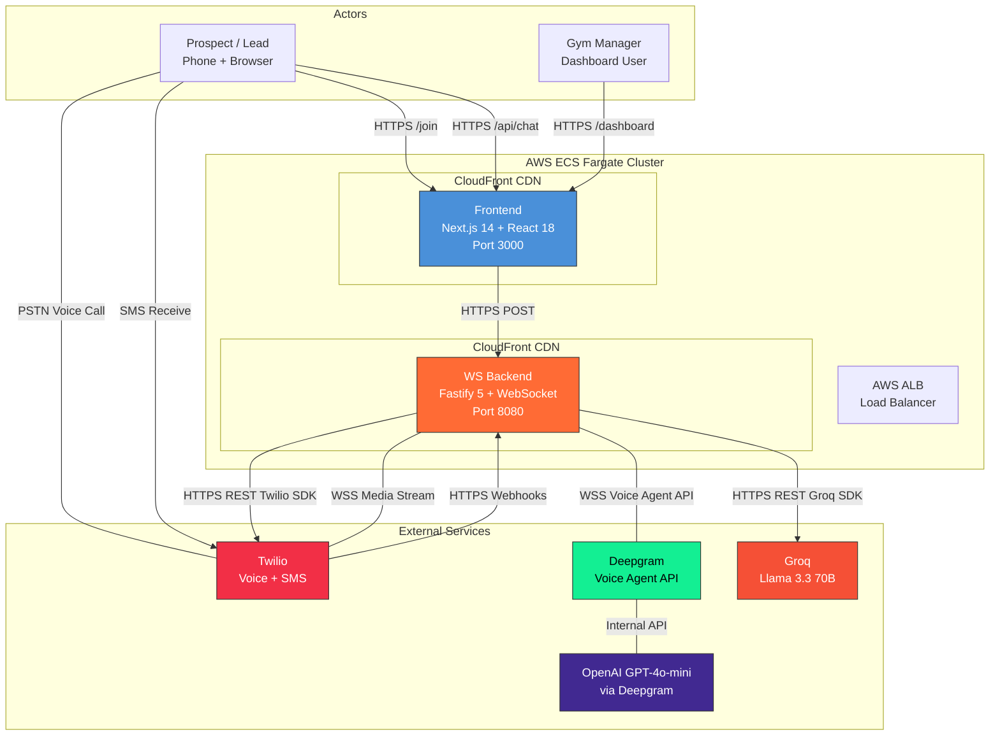
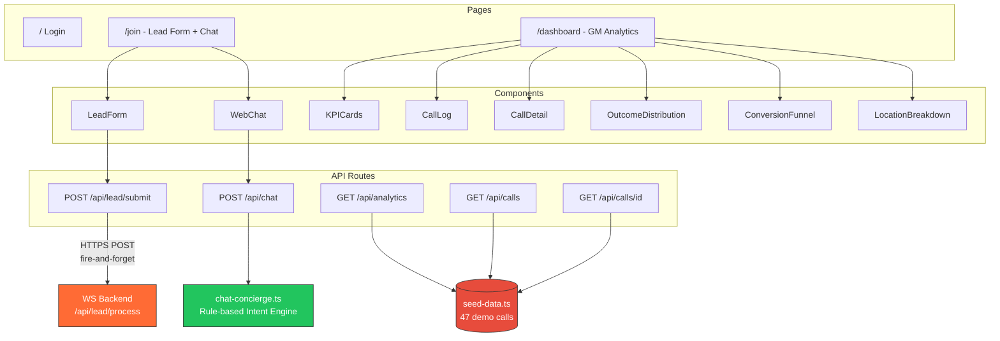
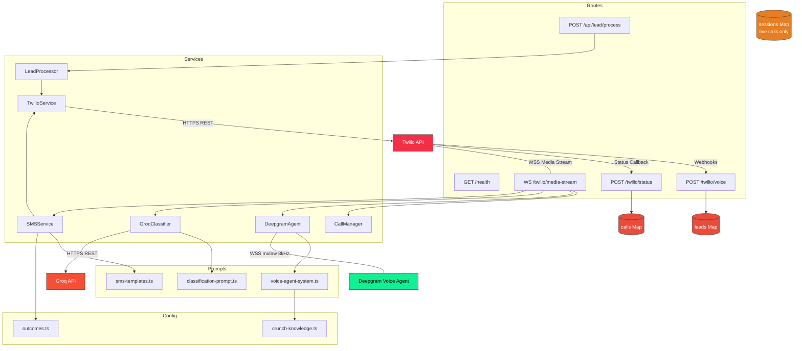
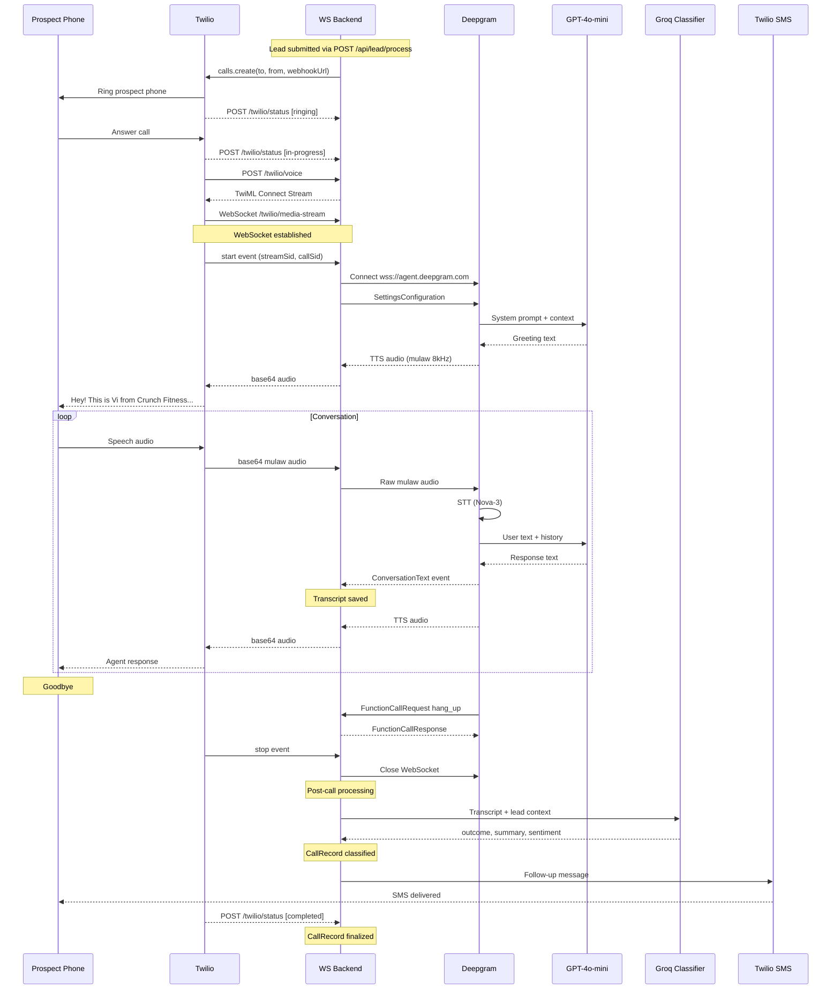
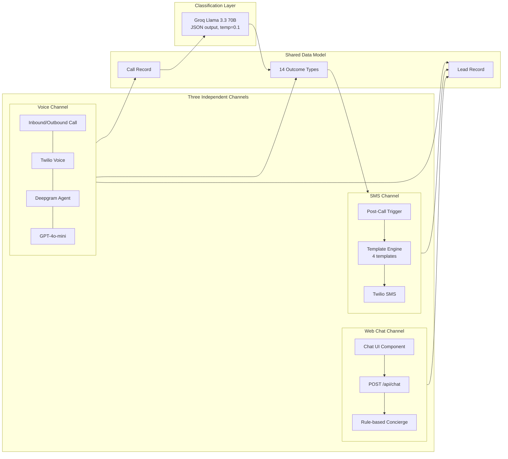
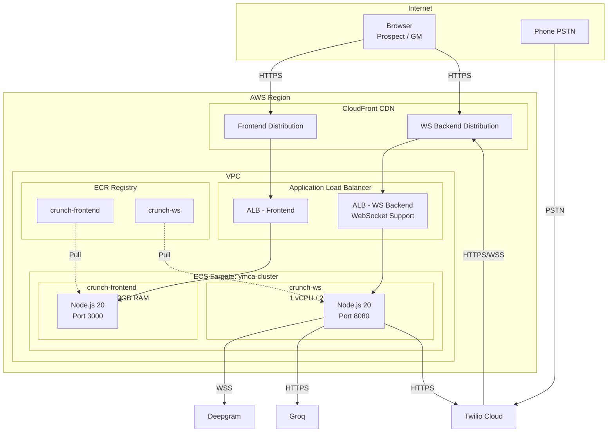

# Vi Operate for Crunch Fitness

**AI-Powered 24/7 Digital Growth Engine** -- Lead conversion, membership sales, guest pass activation, and member retention across Crunch Fitness's Colorado Springs locations.

Vi Operate deploys an omnichannel AI sales agent ("Vi") that handles voice calls, web chat, and SMS follow-ups. Prospects interact with Vi through a branded landing page, receive an AI-powered phone call within seconds, and are automatically classified and followed up via text message. Gym managers monitor performance through a real-time analytics dashboard.

**Version 1.0 | March 2026 | Demo Deployment**

---

## Table of Contents

- [System Overview](#system-overview)
- [Architecture](#architecture)
  - [System Context](#system-context)
  - [Internal Architecture](#internal-architecture)
  - [Voice Call Pipeline](#voice-call-pipeline)
  - [Multi-Channel Design](#multi-channel-design)
  - [Deployment Infrastructure](#deployment-infrastructure)
- [Project Structure](#project-structure)
- [Getting Started](#getting-started)
  - [Prerequisites](#prerequisites)
  - [Environment Setup](#environment-setup)
  - [Running Locally](#running-locally)
  - [Docker Build](#docker-build)
- [Core Concepts](#core-concepts)
  - [AI Model Strategy](#ai-model-strategy)
  - [Conversation Design](#conversation-design)
  - [14-Outcome Classification System](#14-outcome-classification-system)
  - [Deterministic vs Probabilistic Layers](#deterministic-vs-probabilistic-layers)
- [API Reference](#api-reference)
  - [Frontend API Routes](#frontend-api-routes)
  - [WS Backend Endpoints](#ws-backend-endpoints)
- [Data Model](#data-model)
- [Configuration](#configuration)
  - [Crunch Knowledge Base](#crunch-knowledge-base)
  - [SMS Templates](#sms-templates)
  - [Environment Variables](#environment-variables)
- [Deployment](#deployment)
- [Technology Stack](#technology-stack)
- [Known Limitations](#known-limitations)
- [Roadmap](#roadmap)

---

## System Overview

Vi Operate serves two Colorado Springs Crunch Fitness locations (South Academy & North Academy) with three coordinated communication channels:

| Channel | Technology | AI Model | Purpose |
|---------|-----------|----------|---------|
| **Voice** | Twilio + Deepgram Voice Agent | GPT-4o-mini | Outbound/inbound phone calls with real-time AI conversation |
| **Web Chat** | Next.js + Rule-based Concierge | Deterministic Intent Engine | In-browser chat after lead form submission |
| **SMS** | Twilio Messaging | Template-driven | Automated post-call follow-ups based on call outcome |

A fourth AI model, **Groq Llama 3.3 70B**, runs post-call to classify every conversation into one of 14 structured outcomes with confidence scores, sentiment analysis, and actionable summaries.

### User Journeys

**Prospect Flow:**
1. Visits `/join` and fills out the lead form (name, phone, email, pass type, location)
2. Immediately enters a **web chat** with Vi (rule-based concierge) for instant Q&A
3. Within seconds, receives an **AI phone call** from Vi (Deepgram + GPT-4o-mini)
4. After the call, the conversation is **classified** by Groq and an **SMS follow-up** is sent automatically

**Gym Manager Flow:**
1. Logs into `/dashboard` with password authentication
2. Views real-time KPIs: call volume, connect rate, conversion rate, tour bookings
3. Filters call log by location, outcome, or search term
4. Drills into individual calls to read full transcripts, AI summaries, and sentiment scores
5. Compares performance across South Academy vs North Academy locations

---

## Architecture

### System Context

The highest-level view shows Vi Operate's two containers, the external services they depend on, and the two user types that interact with the system.



**Key relationships:**

- The **Frontend** communicates with the WS Backend (for lead processing) and handles chat locally via a deterministic rule-based concierge. All AI/telephony orchestration is handled by the backend.
- The **WS Backend** is the system's nerve center. It maintains persistent WebSocket connections with both Twilio (audio streaming) and Deepgram (voice AI), while making REST calls to Twilio (call initiation, SMS) and Groq (classification).
- **OpenAI GPT-4o-mini** is accessed indirectly through Deepgram's Voice Agent API -- the backend never calls OpenAI directly.
- **Twilio** plays a dual role: it initiates calls via REST API *and* calls back into the backend via webhooks and WebSocket media streams.

---

### Internal Architecture

This diagram zooms into both containers, showing every page, API route, service, and data store, along with all cross-container and external data flows.

#### Frontend Container



#### WS Backend Container



**How to read these diagrams:**

- **Red cylindrical nodes** are in-memory data stores (JavaScript Maps). All data is ephemeral and reloaded from seed data on restart.
- **Orange node** (`sessions Map`) holds active call session data only during live calls.
- The frontend's dashboard API routes read from **frontend-local seed data**, not from the WS backend. This is intentional for the demo so the dashboard always has realistic data.
- The only cross-container data flow is `POST /api/lead/submit` -> `POST /api/lead/process`, which is fire-and-forget with a 5-second timeout.

---

### Voice Call Pipeline

This is the most complex data flow in the system. It shows the full lifecycle of a voice call -- from lead submission through real-time conversation to post-call classification and SMS follow-up.



**Key phases:**

1. **Call Initiation** -- The WS backend calls Twilio's REST API to dial the prospect. Twilio rings the phone and sends status updates back via webhooks.

2. **Audio Bridge Setup** -- When the prospect answers, Twilio requests TwiML instructions, which tell it to open a WebSocket media stream back to the backend. The backend simultaneously opens a WebSocket to Deepgram's Voice Agent API and configures it with the system prompt, function definitions, and audio codec settings (mulaw, 8kHz).

3. **Real-Time Conversation** -- Audio flows bidirectionally: Twilio sends the prospect's speech as base64-encoded mulaw, the backend decodes and forwards it to Deepgram, which runs STT (Nova-3) + LLM (GPT-4o-mini) + TTS (Aura-2) and sends synthesized audio back through the same chain. The `ConversationText` messages from Deepgram are accumulated as transcript entries in the backend's memory.

4. **Call Termination** -- The Deepgram agent can call a `hang_up` function when the conversation naturally concludes, or the prospect can hang up directly. Twilio sends a `stop` event on the WebSocket.

5. **Post-Call Processing** -- The full transcript is sent to Groq's Llama 3.3 70B model for classification. Groq returns a structured JSON response with outcome, confidence, sentiment, key moments, and objections. Based on the classified outcome, an SMS template is selected and sent to the prospect via Twilio.

---

### Multi-Channel Design

The three channels (voice, chat, SMS) operate independently but feed a shared data model and classification system.



Each channel uses a **different AI model** optimized for its specific task:
- **Voice** uses GPT-4o-mini via Deepgram for low-latency conversational responses
- **Chat** uses a deterministic rule-based concierge engine with intent detection, info cards, and quick replies
- **Classification** uses Llama 3.3 70B on Groq for high-accuracy structured output

SMS is not conversational -- it is triggered automatically after call classification and uses one of four pre-defined templates based on the call outcome. The classification layer acts as the bridge between the voice channel and SMS channel: once a call is classified, the outcome determines which SMS template (if any) to send.

---

### Deployment Infrastructure

Both containers run on AWS ECS Fargate behind CloudFront CDN and an Application Load Balancer. The ALB is critical for maintaining persistent WebSocket connections during active voice calls.



Each ECS task gets **1 vCPU and 2GB RAM**. Docker images are multi-stage builds based on `node:20-alpine` for minimal image size. The shared ECS cluster (`ymca-cluster`) hosts both services with separate task definitions and ECR repositories.

The request path is: **Browser/Twilio -> CloudFront -> ALB -> ECS Task**. CloudFront provides edge caching for static assets (frontend) and TLS termination. The ALB routes traffic to the correct target group and supports WebSocket upgrades for the media stream endpoint.

---

## Project Structure

```
Vi_CF/
├── frontend/                          # Next.js 14 web application
│   ├── src/app/
│   │   ├── page.tsx                   # Login page (password gate)
│   │   ├── layout.tsx                 # Root layout + metadata
│   │   ├── globals.css                # Tailwind + Crunch brand styles
│   │   ├── join/
│   │   │   └── page.tsx               # Lead form + chat (PUBLIC)
│   │   ├── dashboard/
│   │   │   └── page.tsx               # GM dashboard (PROTECTED)
│   │   ├── api/
│   │   │   ├── auth/
│   │   │   │   ├── login/route.ts     # POST: Password auth, sets httpOnly cookie
│   │   │   │   ├── check/route.ts     # GET: Session validation
│   │   │   │   └── logout/route.ts    # POST: Clear session cookie
│   │   │   ├── lead/submit/route.ts   # POST: Lead submission -> WS backend
│   │   │   ├── chat/route.ts          # POST: Gemini chat proxy
│   │   │   ├── analytics/route.ts     # GET: Dashboard KPIs (cookie-protected)
│   │   │   ├── calls/route.ts         # GET: Paginated call log (cookie-protected)
│   │   │   ├── calls/[id]/route.ts    # GET: Call detail + transcript (cookie-protected)
│   │   │   └── orchestrator/route.ts  # GET: Multi-channel orchestration
│   │   ├── components/
│   │   │   ├── PublicHeader.tsx        # Navigation header
│   │   │   ├── LeadForm.tsx           # Lead capture form
│   │   │   ├── WebChat.tsx            # Gemini chat interface
│   │   │   └── Dashboard/
│   │   │       ├── KPICards.tsx        # Animated metric cards
│   │   │       ├── CallLog.tsx         # Filterable call table
│   │   │       ├── CallDetail.tsx      # Transcript + analysis modal
│   │   │       ├── OutcomeDistribution.tsx
│   │   │       ├── ConversionFunnel.tsx
│   │   │       ├── LocationBreakdown.tsx
│   │   │       ├── OrchestratorView.tsx
│   │   │       ├── CrunchAICommand.tsx   # AI command palette overlay
│   │   │       └── Tooltip.tsx           # Reusable tooltip component
│   │   └── lib/
│   │       ├── seed-data.ts           # Deterministic demo data (PRNG seed=42)
│   │       ├── types.ts               # TypeScript interfaces
│   │       ├── constants.ts           # Pricing, locations, brand colors
│   │       └── utils.ts               # Formatting helpers
│   ├── Dockerfile
│   ├── package.json
│   └── tailwind.config.ts
│
├── ws-backend/                        # Fastify WebSocket server
│   ├── src/
│   │   ├── server.ts                  # Entry point, route registration
│   │   ├── routes/
│   │   │   ├── health.ts             # GET /health
│   │   │   ├── twilio-voice.ts       # POST /twilio/voice (TwiML response)
│   │   │   ├── twilio-media.ts       # WS /twilio/media-stream (audio bridge)
│   │   │   └── twilio-status.ts      # POST /twilio/status (lifecycle)
│   │   ├── services/
│   │   │   ├── lead-processor.ts     # Lead -> Twilio call orchestration
│   │   │   ├── twilio-service.ts     # Twilio SDK wrapper (singleton)
│   │   │   ├── deepgram-agent.ts     # Voice Agent WebSocket client
│   │   │   ├── call-manager.ts       # Active session tracking (singleton)
│   │   │   ├── groq-classifier.ts    # Post-call classification
│   │   │   └── sms-service.ts        # Template-based SMS follow-up
│   │   ├── prompts/
│   │   │   ├── voice-agent-system.ts # Vi's personality + conversation rules
│   │   │   ├── classification-prompt.ts # 14-outcome classifier prompt
│   │   │   └── sms-templates.ts      # SMS message templates
│   │   ├── config/
│   │   │   ├── crunch-knowledge.ts   # Locations, pricing, classes, amenities
│   │   │   └── outcomes.ts           # 14 outcome type definitions
│   │   ├── types/
│   │   │   └── index.ts              # Shared TypeScript interfaces
│   │   └── seed-data.ts              # 47 demo calls with transcripts
│   ├── Dockerfile
│   └── package.json
│
├── Crunch_Full_Technical_Spec.md      # Full technical specification
├── ARCHITECTURE.md                    # Architecture analysis + detailed diagrams
└── crunch_reqs.txt                    # Original requirements
```

---

## Getting Started

### Prerequisites

- **Node.js** 20+ (recommended: install via [nvm](https://github.com/nvm-sh/nvm))
- **npm** (bundled with Node.js)
- API keys for:
  - [Twilio](https://www.twilio.com/) -- Account SID, Auth Token, Phone Number
  - [Deepgram](https://deepgram.com/) -- API Key
  - [Groq](https://console.groq.com/) -- API Key (optional; system falls back gracefully if absent)
- For voice calls: a publicly accessible URL (use [ngrok](https://ngrok.com/) for local development)

### Environment Setup

**Frontend** -- copy `.env.example` to `.env.local`:

```bash
cd frontend
cp .env.example .env.local
```

Edit `.env.local`:
```env
# WS Backend URL (must be reachable from browser for lead submission)
NEXT_PUBLIC_WS_BACKEND_URL=http://localhost:8080
WS_BACKEND_INTERNAL_URL=http://localhost:8080

# Dashboard password
DASHBOARD_PASSWORD=crunch2026
```

**WS Backend** -- copy `.env.example` to `.env`:

```bash
cd ws-backend
cp .env.example .env
```

Edit `.env`:
```env
# Twilio (required for voice calls and SMS)
TWILIO_ACCOUNT_SID=your_account_sid
TWILIO_AUTH_TOKEN=your_auth_token
TWILIO_PHONE_NUMBER=+1XXXXXXXXXX

# Twilio Webhook (public URL for Twilio callbacks -- use ngrok for local dev)
TWILIO_WEBHOOK_URL=https://your-ngrok-url.ngrok.io/twilio/voice

# Deepgram (required for voice AI)
DEEPGRAM_API_KEY=your_deepgram_key

# Groq (optional -- falls back to default classification if absent)
GROQ_API_KEY=your_groq_key

# Server
PORT=8080
HOST=0.0.0.0
NODE_ENV=development
LOG_LEVEL=info

# Frontend URL (for CORS)
FRONTEND_URL=http://localhost:3000
```

### Running Locally

Start both services in separate terminals:

```bash
# Terminal 1: WS Backend
cd ws-backend
npm install
npm run dev          # Starts Fastify with hot reload (tsx watch) on port 8080

# Terminal 2: Frontend
cd frontend
npm install
npm run dev          # Starts Next.js dev server on port 3000
```

The frontend is at `http://localhost:3000` and the backend at `http://localhost:8080`.

**Dashboard access:** Navigate to `http://localhost:3000` and enter the dashboard password (set via `DASHBOARD_PASSWORD` env var, defaults to `crunch2026` for demo).

**For voice calls** to work locally, Twilio needs a public URL to send webhooks. Use ngrok:

```bash
ngrok http 8080
```

Then update `TWILIO_WEBHOOK_URL` in `ws-backend/.env` with the ngrok HTTPS URL.

### Docker Build

Both services use multi-stage Docker builds for minimal production images:

```bash
# Frontend (requires next.config.mjs to include: output: 'standalone')
cd frontend
docker build -t crunch-frontend .

# WS Backend
cd ws-backend
docker build -t crunch-ws .
```

Run with environment variables:

```bash
docker run -p 3000:3000 --env-file .env.local crunch-frontend
docker run -p 8080:8080 --env-file .env crunch-ws
```

---

## Core Concepts

### AI Model Strategy

The system uses four AI models, each selected for a specific task based on latency, cost, and accuracy trade-offs:

| Task | Model | Provider | Why This Model |
|------|-------|----------|---------------|
| Voice conversation | GPT-4o-mini | OpenAI (via Deepgram) | Low latency, conversational quality, cost-effective for real-time voice |
| Web chat | Rule-based Concierge | Local (no API) | Deterministic intent detection with 30+ intents, info cards, and quick replies |
| Post-call classification | Llama 3.3 70B | Groq | High accuracy structured JSON, quasi-deterministic at temperature=0.1 |
| Speech-to-text | Nova-3 | Deepgram | Telephony-optimized STT, real-time streaming |
| Text-to-speech | Aura-2 (Thalia) | Deepgram | Natural-sounding voice, mulaw telephony codec support |

### Conversation Design

Vi's conversation is guided by a system prompt, not a hard-coded state machine. The prompt defines conversation phases as guidelines:

1. **Greeting** -- Warm, personalized opener using the prospect's name
2. **Qualification** -- Understand their fitness goals and interests
3. **Information** -- Share relevant pricing, classes, and amenities
4. **Booking** -- Offer guest pass activation or tour booking
5. **Confirmation** -- Confirm next steps and details
6. **Close** -- Friendly goodbye with encouragement

The agent has two function tools:
- **`hang_up`** -- Gracefully end the call
- **`send_sms`** -- Signal that an SMS should be sent (actual sending happens post-call)

Escalation rules are deterministic and hard-coded in the prompt: requests for a manager, complaint keywords, call duration limits, and repeated "I don't know" responses all trigger escalation regardless of LLM output.

### 14-Outcome Classification System

Every completed call is classified into exactly one of 14 outcomes by the Groq classifier:

| Outcome | Conversion? | SMS Template Sent |
|---------|:-----------:|-------------------|
| `tour-booked` | Yes | Tour confirmation with location details |
| `membership-sold` | Yes | Welcome message |
| `guest-pass-issued` | Yes | Pass info with address and hours |
| `trial-activated` | Yes | Pass info with address and hours |
| `appointment-scheduled` | Yes | Tour confirmation |
| `win-back-success` | Yes | Pass info with address and hours |
| `callback-requested` | No | General follow-up |
| `info-sent` | No | Pricing summary |
| `info-provided` | No | Pricing summary |
| `nurture` | No | General follow-up |
| `voicemail` | No | General follow-up |
| `tech-issue` | No | General follow-up |
| `no-answer` | No | *(none)* |
| `declined` | No | *(none)* |

The classifier also produces:
- **Confidence score** (0--1) -- Model's certainty in the outcome
- **Sentiment score** (0--100) -- Overall conversation tone
- **Key moments** -- Notable points in the conversation
- **Objections** -- Concerns raised by the prospect
- **Next action** -- Recommended follow-up

### Deterministic vs Probabilistic Layers

A core architectural principle separates business logic from AI conversation:

**Deterministic layer** (predictable, auditable, never hallucinated):
- Membership pricing and tier eligibility
- Guest pass rules and validation
- Location routing and hours of operation
- Escalation triggers
- Outcome classification (temperature=0.1, structured JSON)
- SMS template selection based on outcome

**Probabilistic layer** (natural, flexible, LLM-driven):
- Conversational responses and tone
- Personality adaptation based on prospect mood
- Handling ambiguous utterances
- Contextual topic transitions
- Conversational repair when misunderstandings occur

This separation ensures compliance-critical decisions (pricing, eligibility, escalation) are never left to LLM randomness, while the conversation itself remains natural and engaging.

---

## API Reference

### Frontend API Routes

| Route | Method | Auth | Description |
|-------|--------|------|-------------|
| `/api/lead/submit` | POST | None | Validates lead form, forwards to WS backend, returns `leadId` |
| `/api/chat` | POST | None | Processes messages via rule-based concierge engine with lead context |
| `/api/auth/login` | POST | None | Validates password, sets `crunch_session` httpOnly cookie |
| `/api/auth/check` | GET | Cookie | Returns auth status from session cookie |
| `/api/auth/logout` | POST | None | Clears session cookie |
| `/api/analytics` | GET | Cookie | KPIs, location breakdown, outcome distribution, funnel, daily trends |
| `/api/calls` | GET | Cookie | Paginated call log with location/outcome/search filters |
| `/api/calls/[id]` | GET | Cookie | Full call detail: transcript, summary, classification |
| `/api/orchestrator` | GET | None | Multi-channel orchestration analytics (demo data) |

Dashboard data routes (`/api/analytics`, `/api/calls`, `/api/calls/[id]`) are protected server-side via `crunch_session` httpOnly cookie. Requests without a valid session receive `401 Unauthorized`. All protected data routes set `Cache-Control: private, max-age=30, stale-while-revalidate=60`.

**POST /api/lead/submit** -- Request body:
```json
{
  "firstName": "string",
  "lastName": "string",
  "phone": "string (US format, 10 digits)",
  "email": "string",
  "passType": "1-day | 3-day | 7-day",
  "interest": "string",
  "location": "south-academy | north-academy"
}
```

**GET /api/analytics** -- Query parameters:
- `period`: `today` | `week` | `all` (default: `all`)

**GET /api/calls** -- Query parameters:
- `location`: `south-academy` | `north-academy`
- `outcome`: any OutcomeType value
- `search`: free-text on name/phone
- `page`: integer (default: 1)
- `limit`: 1--100 (default: 20)

### WS Backend Endpoints

| Route | Method | Description |
|-------|--------|-------------|
| `/health` | GET | Health check: `{status, uptime, timestamp}` |
| `/api/lead/process` | POST | Accepts lead data, initiates Twilio outbound call |
| `/twilio/voice` | POST | Twilio webhook -- returns TwiML with media stream URL |
| `/twilio/media-stream` | WebSocket | Real-time audio bridge between Twilio and Deepgram |
| `/twilio/status` | POST | Twilio status callback for call lifecycle events |

---

## Data Model

### Lead Lifecycle

```
new --> calling --> connected --> completed --> classified --> followed-up
  \
   \--> no-answer (retryable, up to 3 attempts)
```

### Core Interfaces

```typescript
// Lead -- a prospect who submitted the form
interface Lead {
  id: string;
  firstName: string;
  lastName: string;
  phone: string;              // E.164 format (+1XXXXXXXXXX)
  email: string;
  passType: '1-day' | '3-day' | '7-day';
  interest: string;
  location: 'south-academy' | 'north-academy';
  status: LeadStatus;         // new | calling | connected | completed | classified | followed-up | no-answer
  source: 'web-form' | 'inbound-call' | 'manual';
  createdAt: string;
  callAttempts: number;
  lastCallAttempt: string | null;
  callId: string | null;
}

// CallRecord -- a single voice call with full transcript and classification
interface CallRecord {
  id: string;
  leadId: string;
  callSid: string;            // Twilio call identifier
  direction: 'outbound' | 'inbound';
  location: Location;
  status: CallStatus;         // initiated | ringing | connected | completed | failed | no-answer
  duration: number;            // seconds
  startedAt: string;
  connectedAt: string | null;
  endedAt: string | null;
  outcome: OutcomeType | null; // one of 14 outcomes
  outcomeConfidence: number;   // 0-1
  sentiment: number;           // 0-100
  summary: string | null;      // AI-generated 2-3 sentence summary
  keyMoments: string[];
  objections: string[];
  nextAction: string | null;
  transcript: TranscriptEntry[];
  smsFollowUpSent: boolean;
  smsFollowUpTemplate: string | null;
  smsFollowUpSentAt: string | null;
}
```

### Storage (v1 -- Demo)

All data is stored in **in-memory JavaScript Maps**. On startup, 47 pre-generated demo calls are loaded from `seed-data.ts` to populate the dashboard. Data does not persist across restarts.

| Store | Location | Contents |
|-------|----------|----------|
| `leads` | WS Backend `server.ts` | Active leads + seed leads |
| `calls` | WS Backend `server.ts` | All call records with transcripts |
| `sessions` | WS Backend `call-manager.ts` | Active call sessions only (ephemeral, during live calls) |
| `seed-data.ts` | Frontend `lib/` | 47 deterministic demo calls (PRNG seed=42) for dashboard |

---

## Configuration

### Crunch Knowledge Base

Location and business data is centralized in `ws-backend/src/config/crunch-knowledge.ts` and injected into both the voice agent's system prompt and SMS templates:

**Locations:**

| Location | Address | Hours | Staffed Hours |
|----------|---------|-------|---------------|
| Crunch South Academy | 1801 S Academy Blvd, Colorado Springs, CO | Mon-Fri 5am-11pm, Sat-Sun 7am-9pm | Mon-Fri 9am-9pm, Sat 9am-5pm, Sun 10am-5pm |
| Crunch North Academy | 5620 N Academy Blvd, Colorado Springs, CO | Mon-Fri 5am-11pm, Sat-Sun 7am-9pm | Mon-Fri 9am-9pm, Sat 9am-5pm, Sun 10am-5pm |

**Membership Tiers:**

| Tier | Price | Key Features |
|------|-------|-------------|
| Base | $9.99/month | Group fitness classes, basic cardio & strength equipment, locker rooms |
| Peak | $24.99/month | + hydromassage, tanning, guest privileges, all-location access |
| Peak Results | Premium (varies) | + personal training credits, nutrition coaching, priority class booking |

**Class Categories:** Cycling, Kickboxing, Yoga, HIIT, Zumba, Body Pump, Pilates, Barre, Boxing, Stretching, Functional Training, Dance, Strength Training, Core, TRX, Rowing (200+ classes per week).

**Amenities:** Group fitness studios, free weights area, cardio floor, functional training zone, stretching area, locker rooms, showers, tanning beds (Peak+), hydromassage (Peak+), personal training area.

### SMS Templates

Four templates in `ws-backend/src/prompts/sms-templates.ts`, each personalized with the prospect's name:

| Template | Triggered By | Content Summary |
|----------|-------------|-----------------|
| `tour_confirmation` | tour-booked, appointment-scheduled | Confirms tour with location address and hours |
| `guest_pass_info` | guest-pass-issued, trial-activated, win-back-success | Pass activation details with gym address and hours |
| `pricing_summary` | info-sent, info-provided | Full Base/Peak/Peak Results pricing breakdown |
| `general_followup` | callback-requested, nurture, voicemail, tech-issue | General "thanks for chatting" with gym info |

All templates sign off with "- Vi @ Crunch Fitness".

### Environment Variables

#### Frontend (.env.local)

| Variable | Required | Default | Purpose |
|----------|:--------:|---------|---------|
| `NEXT_PUBLIC_WS_BACKEND_URL` | Yes | `http://localhost:8080` | WS Backend URL (client-accessible) |
| `WS_BACKEND_INTERNAL_URL` | No | `http://localhost:8080` | Internal backend URL (ECS service discovery) |
| `DASHBOARD_PASSWORD` | No | `crunch2026` | Dashboard password |

#### WS Backend (.env)

| Variable | Required | Default | Purpose |
|----------|:--------:|---------|---------|
| `TWILIO_ACCOUNT_SID` | Yes | -- | Twilio API authentication |
| `TWILIO_AUTH_TOKEN` | Yes | -- | Twilio API authentication |
| `TWILIO_PHONE_NUMBER` | Yes | -- | Outbound caller ID (E.164 format) |
| `TWILIO_WEBHOOK_URL` | Yes | -- | Public URL for Twilio voice webhooks |
| `DEEPGRAM_API_KEY` | Yes | -- | Deepgram Voice Agent authentication |
| `GROQ_API_KEY` | No | -- | Groq classification (falls back to `tech-issue` if absent) |
| `WS_BACKEND_URL` | No | -- | Public WebSocket URL for TwiML media stream |
| `PORT` | No | `8080` | Server listen port |
| `HOST` | No | `0.0.0.0` | Server bind address |
| `NODE_ENV` | No | `development` | Environment mode |
| `LOG_LEVEL` | No | `info` | Fastify logger verbosity |
| `FRONTEND_URL` | No | `*` | CORS allowed origin |

---

## Deployment

### Frontend Deploy (Vercel)

The frontend is deployed to Vercel from the `frontend/` directory:

```bash
cd frontend
vercel --prod --yes
```

### WS Backend Deploy (AWS ECS Fargate)

Build, tag, push, and force-deploy the WS backend:

```bash
cd ws-backend
docker build -t crunch-ws .
docker tag crunch-ws:latest <ACCOUNT_ID>.dkr.ecr.<REGION>.amazonaws.com/crunch-ws:latest
docker push <ACCOUNT_ID>.dkr.ecr.<REGION>.amazonaws.com/crunch-ws:latest
aws ecs update-service --cluster ymca-cluster --service crunch-ws --force-new-deployment
```

### Infrastructure Summary

| Resource | Configuration |
|----------|--------------|
| ECS Cluster | `ymca-cluster` (shared with other Vi Operate projects) |
| ECR Repositories | `crunch-frontend`, `crunch-ws` |
| Task Definitions | 1 vCPU / 2GB RAM per service |
| CloudFront (Frontend) | `ddqqgw7on1vri.cloudfront.net` |
| CloudFront (WS Backend) | `dgsgmuc7zb7i2.cloudfront.net` |
| ALB | Routes to ECS tasks, supports WebSocket connections |
| Docker Base Image | `node:20-alpine` (multi-stage build) |

---

## Technology Stack

| Layer | Technology | Version |
|-------|-----------|---------|
| Frontend Framework | Next.js (App Router) | 14.2.35 |
| UI Library | React | 18.3.1 |
| Styling | Tailwind CSS | 3.4.17 |
| Backend Framework | Fastify | 5.2.1 |
| WebSocket | @fastify/websocket + ws | 11.0.1 / 8.18.0 |
| Language | TypeScript | 5.7.3 |
| Runtime | Node.js | 20 (Alpine) |
| Containerization | Docker | Multi-stage builds |
| Orchestration | AWS ECS Fargate | -- |
| CDN | AWS CloudFront | -- |
| Load Balancer | AWS ALB | -- |
| Container Registry | AWS ECR | -- |
| Telephony + SMS | Twilio SDK | 5.5.1 |
| Voice AI | Deepgram Voice Agent API | WebSocket |
| Chat AI | Rule-based Concierge (local) | -- |
| Classification AI | Groq SDK (Llama 3.3 70B) | 0.9.1 |
| Voice LLM | OpenAI GPT-4o-mini | via Deepgram |
| STT Model | Deepgram Nova-3 | -- |
| TTS Model | Deepgram Aura-2 (Thalia) | -- |
| Data Store | In-Memory Maps | -- |

---

## Demo Data

This repository ships with **47 seeded call records** that populate the dashboard with realistic data. The seed data is generated deterministically using a Mulberry32 PRNG (seed=42), ensuring identical data across builds and environments.

The seed data includes:
- Calls distributed across both locations (20 South Academy, 27 North Academy)
- All 14 outcome types represented with realistic distributions
- Full multi-turn transcripts with agent/caller dialogue
- Sentiment scores, confidence values, and key moments
- Timestamps spread across the last 7 days during business hours (8am-8pm)
- 50 unique first/last name combinations with generated phone numbers and emails

No live Twilio, Deepgram, or Groq credentials are needed to view the dashboard.

---

## Known Limitations

These are intentional trade-offs for the v1 demo deployment:

| Limitation | Impact | Production Path |
|-----------|--------|----------------|
| **In-memory storage** | All data lost on restart; single-instance only | Migrate to PostgreSQL or DynamoDB |
| **No horizontal scaling** | WebSocket sessions tied to one instance | Redis session store + ALB sticky sessions |
| **Simple password auth** | Single shared password; httpOnly cookie session without expiry or CSRF | JWT/SSO with per-user accounts and CSRF protection |
| **No Twilio webhook validation** | Webhook endpoints accept forged requests | Validate `X-Twilio-Signature` via Twilio SDK |
| **CORS wildcard** | Any origin can call backend APIs | Restrict `FRONTEND_URL` to production domain |
| **No rate limiting** | Lead endpoint could trigger unlimited billable calls | Rate limiting middleware on `/api/lead/process` |
| **No circuit breakers** | External service outages cascade | Circuit breaker on Deepgram, Groq, Twilio calls |
| **No graceful shutdown** | Active calls dropped during deploys | SIGTERM handler to drain WebSocket connections |
| **Dashboard reads local seed data** | Dashboard doesn't reflect real-time backend data | Connect dashboard API routes to WS backend |

---

## Roadmap

### Phase 1 (Current) -- Demo MVP
- Lead form with Crunch branding
- AI voice agent (Deepgram + GPT-4o-mini)
- Web chat (rule-based concierge with intent detection)
- Post-call classification (Groq Llama 3.3 70B)
- SMS follow-up templates
- GM dashboard with 47 seeded calls

### Phase 2 -- Production Hardening
- PostgreSQL/DynamoDB for persistent storage
- Per-user accounts with JWT or SSO (currently single shared password with httpOnly cookie)
- Twilio webhook signature validation
- Rate limiting and input sanitization
- Circuit breakers on external service calls
- Graceful shutdown for active WebSocket connections
- Dashboard connected to live backend data

### Phase 3 -- Advanced Features
- No-show detection and re-engagement campaigns
- Win-back outreach for lapsed members
- CRM integration (Salesforce, HubSpot)
- Cross-channel context transfer (chat history available to voice agent)
- A/B testing for conversation prompts
- Spanish language support
- Real-time monitoring and alerting (CloudWatch, PagerDuty)

### Phase 4 -- Multi-Tenant Platform
- Tenant isolation and per-brand configuration
- White-label support for other gym brands (UFC, etc.)
- Self-service brand and location onboarding
- Per-tenant billing and usage tracking

---

## Related Documentation

- **[ARCHITECTURE.md](./ARCHITECTURE.md)** -- Detailed architecture analysis with component inventory, ADR cross-reference, coupling concerns, scalability bottlenecks, and security gap analysis
- **[Crunch_Full_Technical_Spec.md](./Crunch_Full_Technical_Spec.md)** -- Complete technical specification with data models, prompt engineering details, seed data requirements, and build plan

## License

Proprietary. For demonstration purposes only.
